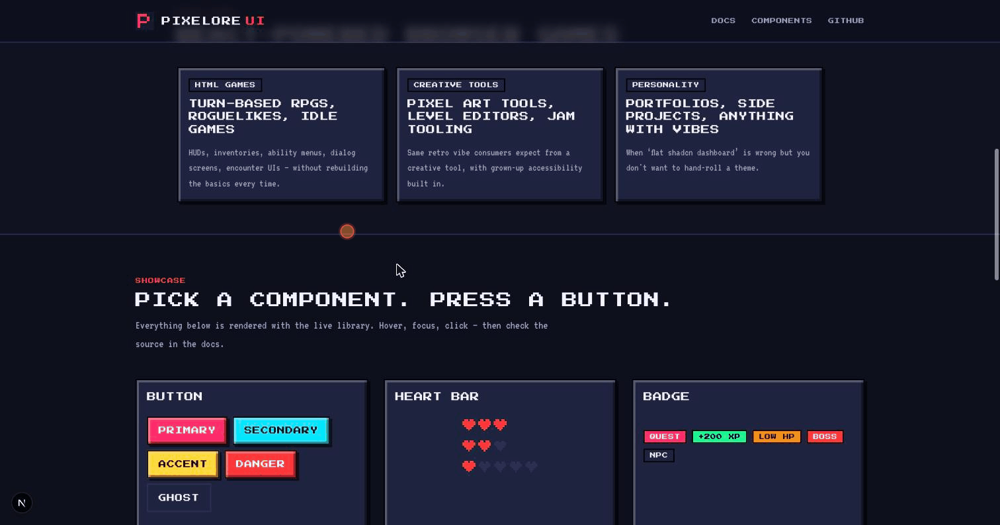

# Pixelore UI

> An 8-bit aesthetic React design system. Accessible. Animated. Pixel-perfect.

[](https://www.npmjs.com/package/@pixelore/react)
[](https://www.npmjs.com/package/@pixelore/react)
[](https://opensource.org/licenses/MIT)
[](https://pixelore-ui.vercel.app)
[](https://pixelore-rpg.vercel.app)

```
██████╗ ██╗██╗  ██╗███████╗██╗      ██████╗ ██████╗ ███████╗  ██╗   ██╗██╗
██╔══██╗██║╚██╗██╔╝██╔════╝██║     ██╔═══██╗██╔══██╗██╔════╝  ██║   ██║██║
██████╔╝██║ ╚███╔╝ █████╗  ██║     ██║   ██║██████╔╝█████╗    ██║   ██║██║
██╔═══╝ ██║ ██╔██╗ ██╔══╝  ██║     ██║   ██║██╔══██╗██╔══╝    ██║   ██║██║
██║     ██║██╔╝ ██╗███████╗███████╗╚██████╔╝██║  ██║███████╗  ╚██████╔╝██║
╚═╝     ╚═╝╚═╝  ╚═╝╚══════╝╚══════╝ ╚═════╝ ╚═╝  ╚═╝╚══════╝   ╚═════╝ ╚═╝
```



## What is this?

A React design system for **HTML / browser games**, with the aesthetic of a 1989
platformer and the engineering of 2026. Components are built on top of
[Radix UI](https://radix-ui.com) primitives, styled with
[Tailwind v4](https://tailwindcss.com), and animated with
[Motion](https://motion.dev) — with full respect for `prefers-reduced-motion`.

If you're building a turn-based RPG, a roguelike, an idle game, a pixel-art
tool, or anything else where "flat shadcn dashboard" is the wrong look but
you still want WCAG 2.2 AA, this is for you. There's a complete live RPG
demo at **[pixelore-rpg.vercel.app](https://pixelore-rpg.vercel.app)** (source
in [`apps/rpg-demo`](./apps/rpg-demo)) — battle screens, HUD, party stats,
inventory, equipment, status effects, multi-phase boss, save/load, NPC
merchants, and hand-authored pixel-art sprites, all wired up.

- **18 components** including a signature **`HeartBar`** for HP / lives, plus the usual Button, Card, Input, Dialog, Tabs, Tooltip, Switch, Checkbox, RadioGroup, Progress, Alert, Avatar, Badge, Label, Separator, Skeleton, Textarea.
- **Two distribution paths**: source CSS for any React app, or a Tailwind v3/v4 preset for projects that want to extend the tokens.
- **Accessible by default**: WCAG 2.2 AA targets, keyboard support, ARIA, screen-reader-tested.
- **Motion-aware**: every animation swaps to opacity under `prefers-reduced-motion`.

## Repo structure

```
pixelore/
├── apps/
│   └── docs/                  # Next.js 16 docs site
├── packages/
│   ├── react/                 # @pixelore/react — the component library
│   └── tailwind-preset/       # @pixelore/tailwind-preset — v3 & v4 presets
├── .changeset/                # Changesets for versioning + publishing
├── .github/workflows/         # CI
├── package.json               # Workspace root
├── pnpm-workspace.yaml
├── turbo.json
└── tsconfig.base.json
```

## Tech stack

| Layer      | Choice              | Why                                                     |
| ---------- | ------------------- | ------------------------------------------------------- |
| Language   | TypeScript 6        | Type safety for component APIs                          |
| Build      | tsup                | Zero-config ESM + CJS + types for a library             |
| Bundle     | Tree-shakable ESM   | Consumers pay only for what they import                 |
| A11y       | Radix UI primitives | Keyboard, ARIA, focus — solved once, by the experts     |
| Styling    | Tailwind v4         | CSS-driven theme tokens with `@theme`                   |
| Animation  | Motion 12           | The successor to Framer Motion; `useReducedMotion` hook |
| Monorepo   | pnpm + Turbo        | Standard for modern multi-package repos                 |
| Versioning | Changesets          | Semver, changelogs, and npm publishing in one tool      |
| Docs       | Next.js 16 + MDX    | App Router, server components, full SEO                 |

## Quick start (consuming the library)

```bash
pnpm add @pixelore/react motion
```

Import the stylesheet once at the root of your app. Pick whichever entry
point matches your stack:

| Framework            | Import location                               |
| -------------------- | --------------------------------------------- |
| Next.js (App Router) | `app/layout.tsx`                              |
| Vite + React         | `src/main.tsx`                                |
| Remix                | `app/root.tsx` (via `links` loader, see docs) |
| Astro island         | `src/pages/<page>.astro` frontmatter          |

```tsx
import '@pixelore/react/styles.css'

import { Button, Card, HeartBar } from '@pixelore/react'

export default function App() {
  return (
    <Card>
      <HeartBar value={2} max={3} />
      <Button variant="primary">Start Game</Button>
    </Card>
  )
}
```

See [the docs site](https://pixelore-ui.vercel.app) for the full component catalogue, accessibility
notes, and motion guidelines.

## Local development

```bash
# Install
pnpm install

# Run the docs site in dev mode (auto-rebuilds the library on changes)
pnpm dev

# Build everything
pnpm build

# Type-check, lint, test
pnpm typecheck
pnpm lint
pnpm test
```

Requires **Node ≥ 20** and **pnpm ≥ 9**. If you don't have pnpm,
`corepack enable && corepack prepare pnpm@9 --activate` will install it.

## Releasing

We use [Changesets](https://github.com/changesets/changesets):

```bash
# After making a user-facing change:
pnpm changeset

# Bump versions and update CHANGELOG.md:
pnpm version-packages

# Publish to npm:
pnpm release
```

## Accessibility

pixelore targets WCAG 2.2 AA. Every interactive primitive is built on a Radix UI component
(or implements the matching WAI-ARIA Authoring Practices pattern). Color contrast in the
default theme passes AA across the board; the focus accent (yellow) hits 4.5:1 on every
surface.

See [the accessibility docs](https://pixelore-ui.vercel.app/docs/accessibility) for the full pattern
catalogue.

## Reduced motion

We respect `prefers-reduced-motion` at **both** the CSS layer (a global cap on transition /
animation durations) and the JS layer (Motion animations branch on `useReducedMotion`).
Translates swap to opacity, scales swap to opacity — the user still gets feedback but no
vestibular cue.

See [the motion docs](https://pixelore-ui.vercel.app/docs/motion) for the full strategy.

## Contributing

PRs welcome — see [CONTRIBUTING.md](./CONTRIBUTING.md).

## License

[MIT](./LICENSE) © Eduardo Sotero
