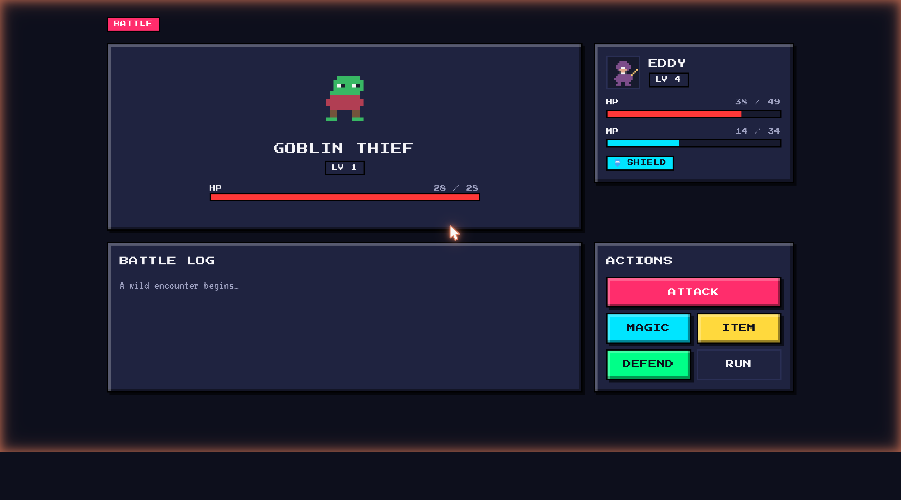

# pixelore quest — RPG demo

A tiny turn-based RPG that doubles as a living showcase of the
[`@pixelore/react`](../../packages/react) design system.



## Play

```bash
pnpm install
pnpm --filter @pixelore/rpg-demo dev
# http://localhost:3040
```

Move on the map with **arrow keys / WASD**, or use the on-screen pad. Random
encounters fire ~22% per step; the **Pixel Dragon** waits at the top-left
corner.

## What you can do

- **Attack** — ATK – DEF damage with crit chance scaled by class + gear
- **Magic** — Fireball (5 MP, 35% chance to inflict Burn) or Heal (4 MP)
- **Defend** — halves incoming damage on the next enemy turn
- **Run** — escape (can't run from a boss)
- **Status effects** — Poison, Burn, Stun, and Shield. Goblins poison on hit,
  skeletons stun, Fireball ignites, and the Aegis Pendant grants a Shield at
  battle start
- **Equipment** — 10 pieces across weapon / armor / trinket slots; the
  merchant has a Gear tab, and stats in the Inventory show the
  derived (base + bonuses) values
- **Boss phases** — the Pixel Dragon telegraphs Fire Breath and enrages at
  50% HP, gaining ATK / SPD and a higher crit rate

Defeating enemies grants XP and may trigger a level-up. The hero has three
**hero stones** (lives) — losing your last one ends the run. Save state is
persisted in `localStorage` (schema v2).

## Pixel art

Every emoji glyph has been replaced with hand-authored pixel-art PNGs
rendered through a small `<Sprite>` component (`src/sprites/`). The full
migration plan and conventions live in [`SPRITES.md`](./SPRITES.md); the
generator that produces every sprite from an ASCII grid is at
[`scripts/generate-sprites.py`](./scripts/generate-sprites.py).

## Components used

Every screen is composed entirely from `@pixelore/react`:

| Screen     | Components                                                                                                  |
| ---------- | ----------------------------------------------------------------------------------------------------------- |
| Title      | Badge, Button, Card, Input, Label, RadioGroup, Separator                                                    |
| Map        | Badge, Button, Card, HeartBar, Progress, Tooltip, Dialog (Settings + NPCs)                                  |
| Battle     | Badge, Button, Card, Tabs (Inventory + Merchant), Tooltip, useReducedMotion + Motion animations             |
| Inventory  | Tabs (Items / Equipment / Quests), Card, Badge, Button, Separator, Tooltip                                  |
| End screen | Badge, Button, Card                                                                                         |

## Move it out later

This app is parked inside the pixelore monorepo for now. Lifting it to its
own repo is a copy of `apps/rpg-demo/` plus depending on the published
`@pixelore/react` from npm (instead of `workspace:*`).
